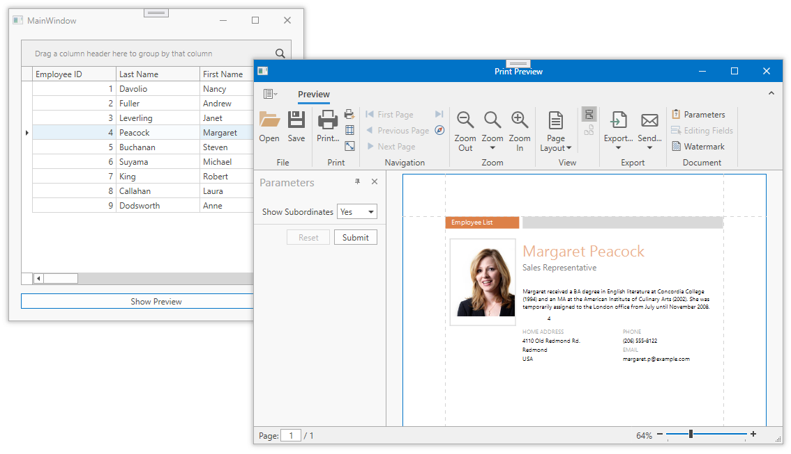

<!-- default badges list -->

<!-- default badges end -->
# How to Use ViewModel Data as Report Parameters in a WPF MVVM Application

This example demonstrates how to pass data from the ViewModel to a report. The row selected in the Data Grid is used as a report parameter. When the user selects a row and clicks a button, a new modal window is invoked. The window contains the DocumentPreviewControl that displays the report with the specified parameter applied.

The `MainViewModel`retrieves a list of employees from the database and tracks the currently selected employee. The MainViewModel defines the **ShowPrintPreview** command that instantiates a report with the current employee as a parameter and creates the **DocumentPreviewViewModel** view model instance that contains the current report. The command uses the [DialogService](https://docs.devexpress.com/WPF/17467/mvvm-framework/services/predefined-set/dialog-services/dialogservice) to show the modal window with the report preview.

<!-- default file list -->
## Files to Look At

- [MainWindow.xaml](./CS/MainWindow.xaml) ([MainWindow.xaml](./VB/MainWindow.xaml))
- [MainViewModel.cs](./CS/Models/MainViewModel.cs) ([MainViewModel.vb](./VB/Models/MainViewModel.vb))
- [DocumentPreviewViewModel.cs](./CS/Models/DocumentPreviewViewModel.cs) ([DocumentPreviewViewModel.vb](./VB/Models/DocumentPreviewViewModel.vb))

<!-- default file list end -->

## Documentation

- [Document Preview API and Customization](https://docs.devexpress.com/XtraReports/119220/wpf-reporting/wpf-reporting-document-preview/api-and-customization)
- [Quick Guide to Print Preview Customization](https://docs.devexpress.com/XtraReports/119228/wpf-reporting/wpf-reporting-document-preview/api-and-customization/quick-guide-to-print-preview-customization)
- [Use Report Parameters](https://docs.devexpress.com/XtraReports/4812/detailed-guide-to-devexpress-reporting/use-report-parameters)
- [DevExpress MVVM Framework](https://docs.devexpress.com/WPF/15112/mvvm-framework)

## More Examples

- [How to provide custom editors for report parameters in WPF](https://github.com/DevExpress-Examples/Reporting_how-to-provide-custom-editors-for-report-parameters-in-wpf-e3359)
